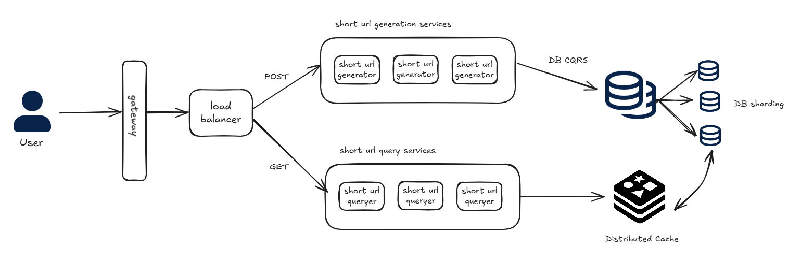
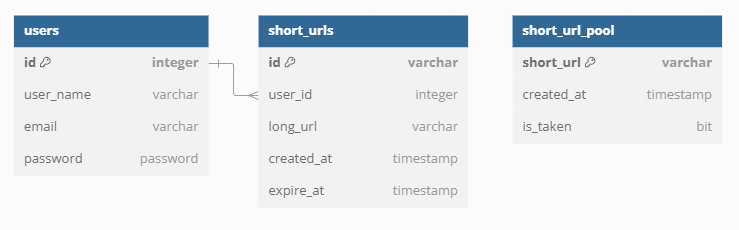

# Design a simple URL shortening service (TinyURL)

## Functional Requirement

### Summary

Design a system for creating a URL shortening service similar to TinyURL. This service will generate concise aliases that redirect to the original, longer URLs. Notable examples of such services include bit.ly, ow.ly, and short.io.

### Must-have functions

#### 1. URL Shortening:

- Users can input a long URL and receive a shortened URL in return.
- The system should generate a **unique**, short alias for each long URL.
- **Restful APIs** for programmatic URL shortening and management.

#### 2. URL Redirection:

- When a user accesses a shortened URL, the system should redirect them to the original long URL.

### Nice-to-have functions

* Custom Alias - Allow users to create custom short URLs if the alias is available and valid.
* Short URL will expire after 1 year after generation by default. Provide an option to set an **expiration date** for the shortened URLs.
* Analytics - **Track** usage statictics for each shortened URL.

## Non-Functional Requirement

1. System could support up to one hundred million of users.
2. Performance - the service should generate short URLs **quickly**, URL redirection should be fast.
3. Ensure that shortened URLs are unique and have no collitions.

## Capacity Estimation

The requirements specify that the system should support up to 100 million users. This is sufficient to begin our capacity estimation.

Assuming each user generates 20 short URLs, and each URL expires after one year, the total number of live URLs will be approximately **2 billion**.

For a typical URL shortening service, the read/write ratio is often 100:1, meaning each generated short URL will be accessed (read) 100 times for every write. As a result, the system must handle **200 billion read requests per year**, which translates to about **6,500 queries per second (QPS)**, with around **60 updates per second**.

In terms of database storage, with approximately **4 billion rows** (2 billion URLs × 2 for necessary data fields) and an average row size of **2 KB**, the total storage required would be around **8 TB**.

## High-Level Design



#### How does the system generally work?

The core idea is that each time a user generates a short URL, a unique short string is created as the key for the original URL. When the user accesses the short URL, the system retrieves the corresponding original URL from the database and performs the redirection.

#### 301 or 302 Redirect

This is an interesting question. It mainly tests your understanding of 301 and 302 redirects, as well as your understanding of browser caching mechanisms.

A **301** is a permanent redirect, while a **302** is a temporary redirect. Once a short URL is generated, it should remain unchanged, so using a 301 redirect aligns with HTTP semantics. However, if we use a 301 redirect, search engines like Google will display the real URL in search results, which means we won't be able to track the number of clicks on the short URL, nor will we be able to collect user information such as cookies and user agents. This data is valuable for big data analysis and is a primary revenue source for URL shortening service providers.

So, the answer is 302.

#### How short can the short URL be?

We should aim to make the URL as short as possible while ensuring there are at least 2 billion unique short URLs. Using only lowercase and uppercase characters, along with digits, a length of 6 characters will be sufficient. This is because 62662^6**6**2**6** gives more than 50 billion unique combinations.

#### Where to store data?

For persistent storage, relational databases like MySQL, PostgreSQL, or Oracle are excellent options. For performance optimization, a caching layer may be required (discussed later), and Redis would be a great choice for this purpose.

#### Does each source URL correspond to a single key (short url)?

A long URL can correspond to a single short URL, or can it correspond to multiple short URLs? This is also a significant design choice.

Generally speaking, a long URL should generate different short URLs depending on factors like location, user, etc. This way, the backend database can better perform data analysis. If a long URL is mapped to a single short URL, there will only be one row of data in the database, making it impossible to distinguish between different sources and thus preventing data analysis.

Moreover, if a long URL can only correspond to a single short URL, when the same long URL is requested multiple times (e.g., by different users), the system would need to check whether the URL has been generated before. This query would significantly increase the system's load, potentially leading to performance issues and other risks.

## Data-Structure Design



> *Why do we need the `short_url_pool` table? What other database optimizations are possible? These questions will be discussed later.*

## API Design

#### Add short url

After user login, he/she could general new short url by post request:

1. A POST endpoint /shorten that accepts a JSON payload with a url field and user_id field.
2. The short url generation service will generate a 6-character string as the short url. This string is unique.
3. The post will trigger services to generate database records in short_urls table, and then update the caching layer.
4. When post successful, it will return response and 201 status code.
5. If there's an error, it will return corresponding response and error code.

##### POST request to https://myshorturldomain/shorten

```
{
  "url": "https://www.example.com/very/long/url/that/needs/shortening",
  "user_id": 6273621
}
```

response

```
{
  "user_id": 6273621,  
  "id":"Ab3x9Y",
  "short_url": "http://myshorturldomain/Ab3x9Y",
  "url": "https://www.example.com/very/long/url/that/needs/shortening",
  "create_at": "2024-11-19 08:28:51.971094",
  "expire_at" : "2025-11-19 08:28:51.971094"
}
```

## Deep-Dive

#### How to generate short url from long url

The most common approach is through hashing. The code snippet below demonstrates this implementation. Note line 4, where we mentioned that for the same long URL, we need to generate a different short URL each time. This is achieved using a timestamp as a salt value.

```
public String generateHashSha256WithInstant(String url) {
        try {
            // Add current timestamp as salt
            String saltedUrl = url + Instant.now().toEpochMilli();

            // Create SHA-256 hash
            MessageDigest md = MessageDigest.getInstance("SHA-256");
            md.update(saltedUrl.getBytes());
            byte[] digest = md.digest();

            // Convert byte array to Base64 string
            String base64 = Base64.getUrlEncoder().encodeToString(digest);

            // Remove any non-alphanumeric characters
            base64 = base64.replaceAll("[^a-zA-Z0-9]", "");

            // Take the first 6 characters
            return base64.substring(0, 6);

        } catch (NoSuchAlgorithmException e) {
            e.printStackTrace();
            return null;
        }
    }
```

In real world, using Distributed global unique ID generation is also a very common approach.

#### How to achieve 302 redirect

The following java code demostrates this implementation.

```
@RestController
@Slf4j
public class UrlRedirectController {
    private final TinyUrlService tinyUrlService;

    public UrlRedirectController(final TinyUrlService tinyUrlService) {
        this.tinyUrlService = tinyUrlService;
    }

    @GetMapping("/{tinyUrl}")
    public ResponseEntity getLongUrl(@PathVariable String tinyUrl) {
        String longUrl = tinyUrlService.getLongUrl(tinyUrl);
        return ResponseEntity.status(HttpStatus.MOVED_PERMANENTLY).header("Location", longUrl).build();
    }
}
```
